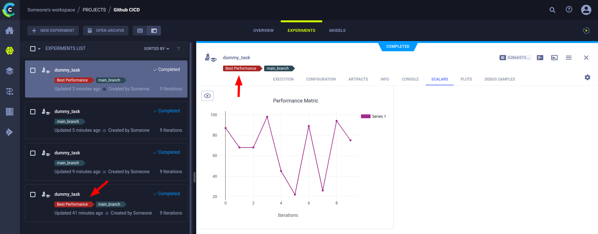

# GitHub Action For Comparing Model Performance Between Current PR and Main Branch



Search ClearML for a task corresponding to the current PR and automatically compare its performance to the previous best task.

The action will identify a ClearML task as "corresponding" to the current PR if:
- The commit hash captured in the task is equal to the commit hash of the current PR
- There are NO uncommitted changes logged on the ClearML task
- The ClearML task was successful

The previous best task in this case is defined as the latest task in ClearML that has the required tag.
Another way to do this could be to do a similar lookup as above but for the last commit-id of the main branch.

## Example usage

```yaml
name: Compare models
on:
  pull_request:
    branches: [ main ]
    types: [ assigned, opened, edited, reopened, synchronize ]

jobs:
  compare-models:
      runs-on: ubuntu-20.04
      steps:
        - name: Compare models
          uses: thepycoder/clearml-actions-compare-models@main
          with:
            CLEARML_API_ACCESS_KEY: ${{ secrets.ACCESS_KEY }}
            CLEARML_API_SECRET_KEY: ${{ secrets.SECRET_KEY }}
            CLEARML_API_HOST: ${{ secrets.CLEARML_API_HOST }}
            CLEARML_PROJECT: 'my_project'
            CLEARML_TASK_NAME: 'my_task'
            CLEARML_SCALAR_TITLE: 'Performance Metrics'
            CLEARML_SCALAR_SERIES: 'mAP'
            CLEARML_SCALAR_MIN_MAX: 'MAX'
            CLEARML_BEST_TAGNAME: 'GOODEST BOI'
          env:
            COMMIT_ID: ${{ github.event.pull_request.head.sha }}
```

## Inputs

1. `CLEARML_API_ACCESS_KEY`: Your ClearML api access key. You can get on by following the steps [here](https://clear.ml/docs/latest/docs/getting_started/ds/ds_first_steps) or reuse one from you `clearml.conf` file. 
2. `CLEARML_API_SECRET_KEY`: Your ClearML api secret key. You can get on by following the steps [here](https://clear.ml/docs/latest/docs/getting_started/ds/ds_first_steps) or reuse one from you `clearml.conf` file. 
3. `CLEARML_API_HOST`: The ClearML api server address. If using the free tier, that's `api.clear.ml` if you have a self-hosted server, you'll have to point this to wherever it is deployed.
4. `CLEARML_PROJECT`: Which project to search in for the task.
5. `CLEARML_TASK_NAME`: Name of the task to compare to the current PR.
6. `CLEARML_SCALAR_TITLE`: Which scalar to use for comparison. Title of the scalar plot.
7. `CLEARML_SCALAR_SERIES`: Which scalar to use for comparison. Series to use within plot given by title.
8. `CLEARML_SCALAR_MIN_MAX`: Whether smaller is better (MIN) or larger is better (MAX). (default: "MAX")
9. `CLEARML_BEST_TAGNAME`: The name of tag to be given to the best task. Every task that is checked and is equal or better than the previous best will get this tag. (default: "Best Performance")
